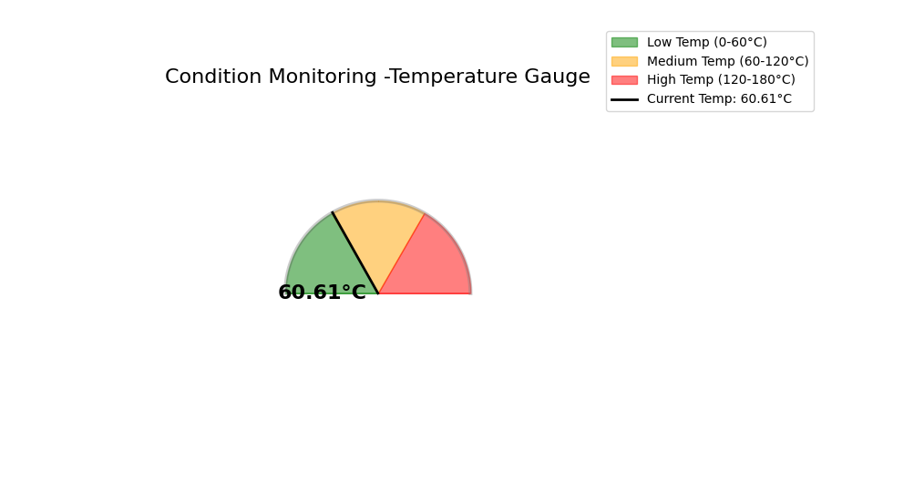
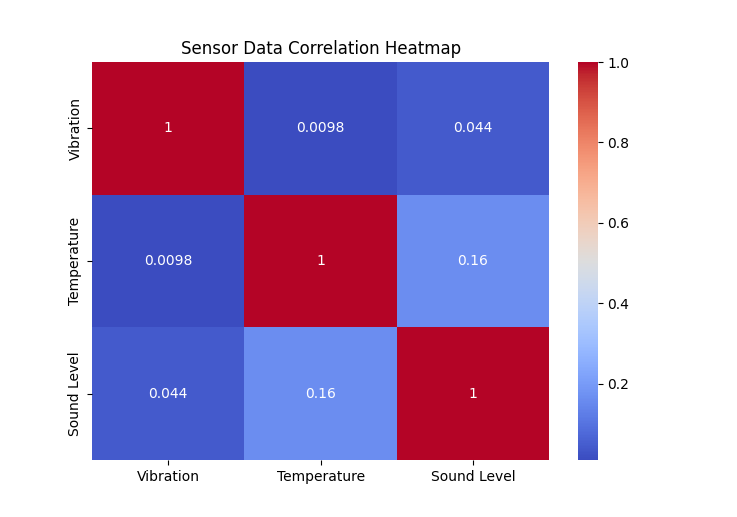
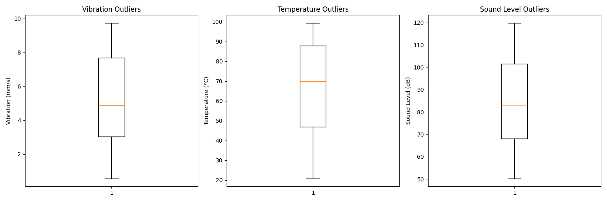
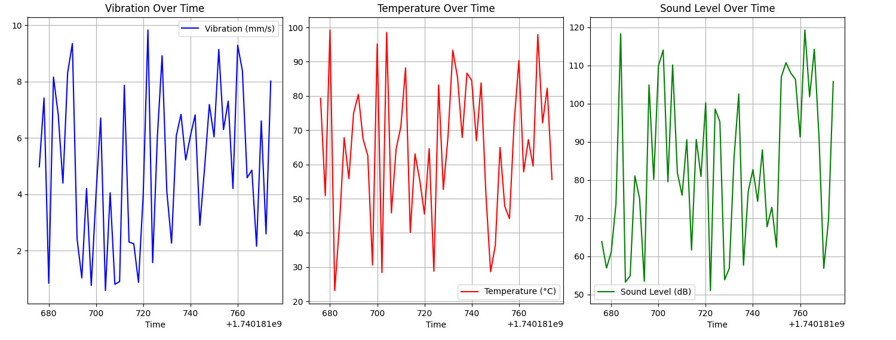
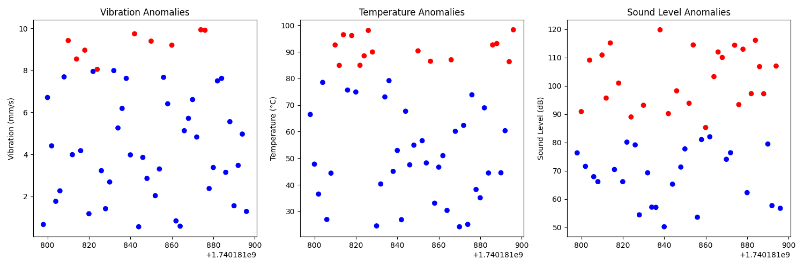

# 🚀 Condition Based Monitoring (CBM) using  Sensor Data Pipeline with Kafka, Visualization & Alerts

This project builds a **real-time sensor data pipeline** using **Kafka**, **Python**, and **Matplotlib**.  
It **streams live sensor data**, processes it, and **visualizes the results dynamically**.  
If anomalies are detected, **SMS alerts** are sent via **Twilio**.

---

## 📌 Features
✅ **Kafka Producer** streams sensor readings (vibration, temperature, sound level)  
✅ **Kafka Consumer** reads and processes live data  
✅ **Real-time Matplotlib animation** for visualization  
✅ **Anomaly detection** for abnormal sensor values  
✅ **Twilio SMS alerts** for critical thresholds  

---

## 📂 Project Structure
  streaming-sensor-pipeline/ │── data/ │ ├── sensor_data.json # Pre-generated sensor readings (500+ records) │── producer/ │ ├── sensor_producer.py # Streams sensor data into Kafka │── consumer/ │ ├── consumer.py # Reads, processes & visualizes data │ ├── consumer_with_alerts.py # Enhanced consumer with SMS alerts │── utils/ │ ├── alert_utils.py # Utility for sending SMS alerts │── README.md # Project Documentation │── requirements.txt # Dependencies


---

## 📌 How It Works

### 1️⃣ **Data Source**
- **Simulated sensor data** (JSON file with 500+ readings)
- Each record contains:
  ```json
  {
    "timestamp": 1708201010,
    "vibration": 2.1,
    "temperature": 65.2,
    "sound_level": 50.3
  }

## Producer (sensor_producer.py)
Reads sensor_data.json
Streams data to Kafka (sensor_data topic)
Simulates real-time streaming by sending data every second


## Consumer (consumer.py)
Reads live sensor data from Kafka
Stores last 50 records (sliding window)
Plots vibration, temperature, sound level dynamically
Auto-scrolls X-axis for real-time effect

### Anomaly Detection & SMS Alerts (consumer_with_alerts.py)
Checks conditions:
Vibration > 8 mm/s → ⚠ Send SMS Alert
Temperature > 80°C → 🔥 Send SMS Alert
Sound Level > 85 dB → 🔊 Send SMS Alert
Uses Twilio API to send alerts to a specified phone number


## 🛠️ Setup & Installation 

# Install Dependencies
pip install -r requirements.txt

# Start Kafka Server
zookeeper-server-start.sh config/zookeeper.properties  # Start Zookeeper
kafka-server-start.sh config/server.properties        # Start Kafka Broker

# Run Producer 
python producer/sensor_producer.py   # This will start streaming sensor data into Kafka.

# Run Consumer (Visualization)
python consumer/consumer.py # Live sensor readings will be plotted in real-time.

# Run Consumer with Alerts
python consumer/consumer_with_alerts.py   # SMS alerts will be sent if thresholds are exceeded. 

# 📊 Visualizations
X-axis → Time (real-time timestamps)
Y-axis → Sensor values (Vibration, Temperature, Sound Level)
Line Colors:
🔵 Vibration (mm/s)
🔴 Temperature (°C)
🟢 Sound Level (dB)
Auto-scrolling x-axis for a smooth live stream effect








# 📩 SMS Alerts Setup (Twilio)
1️⃣ Sign up at Twilio
2️⃣ Get Account SID, Auth Token, Twilio Number
3️⃣ Add credentials to consumer_with_alerts.py
TWILIO_ACCOUNT_SID = "your_account_sid"
TWILIO_AUTH_TOKEN = "your_auth_token"
TWILIO_PHONE_NUMBER = "+1234567890"
ALERT_PHONE_NUMBER = "+1987654321"

4️⃣ Install Twilio SDK:
pip install twilio

📌 Key Takeaways
✅ Kafka-based streaming pipeline for real-time data
✅ Matplotlib animation for live visualization
✅ Twilio SMS alerts for anomaly detection
✅ Scalable & adaptable for real-world applications

# 📬 Future Enhancements
🔹 Email alerts for critical failures
🔹 Multiple Kafka topics for different sensors
🔹 Store processed data in a database (PostgreSQL, MongoDB)
🔹 Deploy as a cloud-based monitoring system


